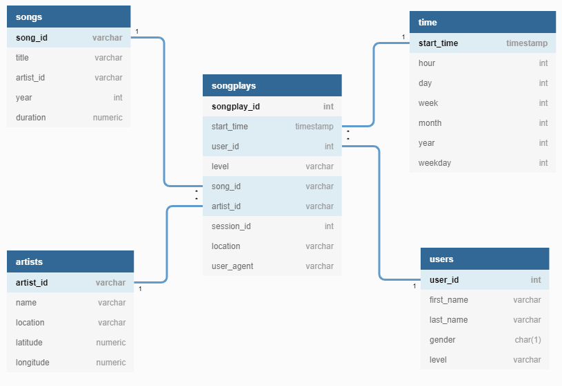

# Data Modeling with Postgres

## Introduction

A startup called Sparkify wants to analyze the data they've been collecting on songs and user activity on their new music streaming app. The analytics team is particularly interested in understanding what songs users are listening to. Currently, they don't have an easy way to query their data, which resides in a directory of JSON logs on user activity on the app, as well as a directory with JSON metadata on the songs in their app.

They'd like a data engineer to create a Postgres database with tables designed to optimize queries on song play analysis, and bring you on the project. Your role is to create a database schema and ETL pipeline for this analysis. You'll be able to test your database and ETL pipeline by running queries given to you by the analytics team from Sparkify and compare your results with their expected results.

## Project Description

In this project, you'll apply what you've learned on data modeling with Postgres and build an ETL pipeline using Python. To complete the project, you will need to define fact and dimension tables for a star schema for a particular analytic focus, and write an ETL pipeline that transfers data from files in two local directories into these tables in Postgres using Python and SQL.

## Prerequisites

This project makes the folowing assumptions:

* Python 3 is available
* `pandas` and `psycopg2` are available
* A PosgreSQL database is available on localhost

## Running the Python Scripts

At the terminal:

1. ```python create_tables.py```
2. ```python etl.py```

In IPython:

1. ```run create_tables.py```
2. ```run etl.py```

## Database Schema

After examining the Log and Song JSON files, I created a Star schema (shown below) that include one Fact table (songplays) and 4 Dimension tables.



This design will offer flexibility with the queries being used for analysis.

## ETL Process

### Song Dataset

The first dataset is a subset of real data from the Million Song Dataset. Each file is in JSON format and contains metadata about a song and the artist of that song. The files are partitioned by the first three letters of each song's track ID. For example, here are filepaths to two files in this dataset.

```
song_data/A/B/C/TRABCEI128F424C983.json
song_data/A/A/B/TRAABJL12903CDCF1A.json
```

And below is an example of what a single song file, TRAABJL12903CDCF1A.json, looks like.

```
{
    "num_songs": 1,
    "artist_id": "ARJIE2Y1187B994AB7",
    "artist_latitude": null,
    "artist_longitude": null,
    "artist_location": "",
    "artist_name": "Line Renaud",
    "song_id": "SOUPIRU12A6D4FA1E1",
    "title": "Der Kleine Dompfaff",
    "duration": 152.92036,
    "year": 0
}
```

This information is parsed to populate the Songs and Artists Dimension tables.

### Log Dataset

The log files in the dataset are partitioned by year and month. For example, here are filepaths to two files in this dataset.

```
log_data/2018/11/2018-11-12-events.json
log_data/2018/11/2018-11-13-events.json
```

This data contains information of which songs Users listened to at a specific time. Information is parsed to provide data for the Songplays Fact table and the Users and Time Dimension tables. The ```songplays.artist_id``` and ```songplays.song_id``` columns are populated by a lookup based on the Song Title, Artist Name and song Duration.

## Description of Files

### Directory: data/log_data

This directory contains a collection of JSON log files. These files are used to populate our Fact table - Song Plays - and to populate the Dimension tables for Users and Time.

### Directory: data/song_data

This directory contains a collection of Song JSON files. These files are used to populate Dimension tables for Songs and Artists.

## create_tables.py

This Python script recreates the database and tables used to storethe data.

## etl.ipynb

A Python Jupyter Notebook that was used to initially explore the data and test the ETL process.

## etl.py

This Python script reads in the Log and Song data files, processes and inserts data into the database.

## requirements.txt

A list of Python modules used by this project.

## sql_queries.py

A Python script that defines all the SQL statements used by this project.

## test.ipynb

A Python Jupyter Notebook that was used to test that data was loaded properly.